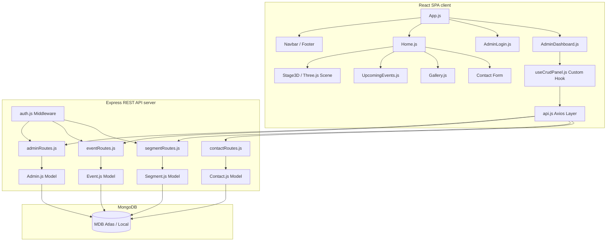

# Infinity Events & Entertainment — Developer Reference Guide

Welcome to the internal developer guide for the Infinity Events & Entertainment full-stack website. This guide is designed to help new developers quickly onboard, understand the project's codebase, and start contributing.

---

## 1. Technical Architecture Overview

Infinity Events & Entertainment uses a classic **MERN (MongoDB, Express, React, Node.js)** full-stack architecture, utilizing a monorepo-style split codebase structure with a root orchestration setup. 



### Communication Flow
- The frontend client communicates with the backend server via a structured [Axios](https://github.com/axios/axios) client configuration inside [client/src/api.js](file:///d:/Projects/Infinity-Events-New/client/src/api.js).
- Admin dashboard pages perform secure state modifications using JWT verification. The Bearer token is automatically attached to requests via Axios interceptors and validated on the backend by the auth middleware [server/middleware/auth.js](file:///d:/Projects/Infinity-Events-New/server/middleware/auth.js).

---

## 2. Technology Stack & Core Packages

### Database Layer
- **Mongoose**: Provides schema modeling, validation, and database operations.

### Backend Layer
- **Express**: Handles CORS, JSON parsing, URL encoding, static assets hosting, and route orchestration.
- **bcryptjs**: Used for cryptographically hashing and checking administrator passwords.
- **jsonwebtoken (JWT)**: Used for stateless session tokens returned upon successful admin login.

### Frontend Layer
- **React 18**: Dynamic component-driven SPA interface.
- **React Router Dom (v6)**: Handles route protection, layouts, and public vs. admin page transitions.
- **Axios**: Promised-based HTTP requests with custom authorization interceptors.
- **react-hot-toast**: Interactive notifications overlay for action confirmation.
- **react-intersection-observer**: Triggers screen reveal animations when sections enter the viewport.

### Animation & 3D Layer
- **Three.js + React Three Fiber + Drei**: Renders the high-performance, interactive 3D stage experience.
- **GreenSock (GSAP)**: Powers smooth transitions and canvas effects.
- **Framer Motion**: Smooth entry and exit transitions for popups, modals, and elements.

---

## 3. Directory Structure

Here is a comprehensive overview of files and folders inside the repository:

```
infinity-events/
├── package.json                              # Runs both servers simultaneously via concurrently
├── README.md                                 # High-level overview & deployment configurations
├── DEVELOPER.md                              # [This File] In-depth technical architecture
│
├── server/                                   # Express + MongoDB backend
│   ├── .env                                  # Local server configuration credentials
│   ├── index.js                              # Main server file, DB connector & middleware
│   ├── seed.js                               # Database seeding logic triggered on start
│   │
│   ├── middleware/
│   │   └── auth.js                           # Validates Bearer JWT in the request headers
│   │
│   ├── models/                               # Mongoose DB schema definitions
│   │   ├── Admin.js                          # Admin email + hashed password
│   │   ├── Client.js                         # Hotel/Corporate client logotypes
│   │   ├── Contact.js                        # User-submitted inquiries
│   │   ├── Event.js                          # Upcoming live show details & tickets
│   │   ├── Highlight.js                      # Portfolio items & past achievements
│   │   ├── Segment.js                        # Homepage bento grid section configurations
│   │   ├── Service.js                        # Bullet point services details
│   │   └── Stats.js                          # Numeric statistics & custom counter configurations
│   │
│   └── routes/                               # REST API Route declarations (Express Router)
│       ├── adminRoutes.js                    # Admin auth endpoints
│       ├── clientRoutes.js                   # Client list CRUD handlers
│       ├── contactRoutes.js                  # Inquiry inbox sub-system routes
│       ├── eventRoutes.js                    # Upcoming event CRUD handlers
│       ├── highlightRoutes.js                # Showcase panel CRUD handlers
│       ├── segmentRoutes.js                  # Bento segment panel CRUD handlers
│       ├── serviceRoutes.js                  # Service list CRUD handlers
│       └── statsRoutes.js                    # Landing page stats counter CRUD handlers
│
└── client/                                   # React frontend application
    ├── package.json                          # Client dependencies (React 18, ThreeJS, GSAP, etc.)
    ├── .env                                  # Local React API url configuration
    │
    └── src/
        ├── index.js                          # Entry file rendering App.js into the DOM tree
        ├── index.css                         # Global CSS resets, fonts, and dark theme variables
        ├── api.js                            # Centralized Axios setup with JWT request interceptor
        ├── App.js                            # App-level routing and context wrappers
        │
        ├── context/
        │   └── AuthContext.js                # Core Auth State Provider (login, logout, active admin)
        │
        ├── pages/
        │   ├── Home.js                       # Combines landing page segments into single viewport
        │   ├── AdminLogin.js                 # Admin credentials sign-in portal
        │   └── AdminDashboard.js             # Shell interface hosting admin panels
        │
        └── components/                       # User-interface building blocks
            ├── Cursor.js                     # Animated custom cursor following mouse actions
            ├── Navbar.js                     # Header sticky navigation bar with glassmorphic style
            ├── Hero.js                       # Glowing background canvas with laser beams
            ├── StatsStrip.js                 # Counter statistics widget with react-countup
            ├── About.js                      # Split profile layout presenting corporate values
            ├── Ticker.js                     # Horizontally-scrolling ribbon
            ├── Segments.js                   # Bento grid category boxes with modals
            ├── Services.js                   # Nested service accordion dropdowns
            ├── Stage3D.js                    # 3D canvas wrapper with interactive palette selectors
            ├── Stage3DScene.js               # WebGL engine initializing lighting rigs, trussing, & models
            ├── Gallery.js                    # Visual grid showcasing past events
            ├── Highlights.js                 # Visual portfolio cards displaying highlights
            ├── Testimonials.js               # Customer review slider carousel
            ├── Clients.js                    # Category tabs displaying corporate logos
            ├── UpcomingEvents.js             # Renders database-backed show schedule
            ├── Contact.js                    # Interactive contact form linked to db inbox
            ├── Footer.js                     # Bottom links & location info
            ├── ScrollToTop.js                # Quick return navigation button
            │
            └── admin/                        # Admin-only control panels
                ├── DashboardHome.js          # Main statistics panel & inbox counters
                ├── InboxPanel.js             # Submissions manager with replies & status filters
                ├── EventsPanel.js            # Admin CRUD for upcoming events
                ├── SegmentsPanel.js          # Admin CRUD for homepage bento boxes
                ├── ServicesPanel.js          # Admin CRUD for capabilities details
                ├── HighlightsPanel.js        # Admin CRUD for portfolio items
                ├── ClientsPanel.js           # Admin CRUD for client entries
                ├── StatsPanel.js             # Admin CRUD for numerical stats counters
                └── useCrudPanel.js           # Shared CRUD state manager custom React hook
```

---

## 4. Backend Implementation Details

### Database Models

1. **[Admin Model](file:///d:/Projects/Infinity-Events-New/server/models/Admin.js)**: Contains name, unique email, and bcrypt-hashed password.
2. **[Client Model](file:///d:/Projects/Infinity-Events-New/server/models/Client.js)**: Houses client names and their classification category (`hotel` or `corporate`).
3. **[Contact Model](file:///d:/Projects/Infinity-Events-New/server/models/Contact.js)**: Tracks names, emails, phones, subject, message, status (`New`, `Read`, `Replied`), and response notes.
4. **[Event Model](file:///d:/Projects/Infinity-Events-New/server/models/Event.js)**: Configures scheduled events with fields like title, artist, date, location, category, description, imageUrl, accentColor, ticketUrl, and configuration attributes `isFeatured` and `isActive`.
5. **[Highlight Model](file:///d:/Projects/Infinity-Events-New/server/models/Highlight.js)**: Spotlights past projects using year, tag, name, description, imageUrl, and background gradients.
6. **[Segment Model](file:///d:/Projects/Infinity-Events-New/server/models/Segment.js)**: Homepage bento box metadata including titles, descriptions, custom gradients (`bgGradient`), custom accent colors (`accentColor`), visual gridSpan rules, and sub-offerings.
7. **[Service Model](file:///d:/Projects/Infinity-Events-New/server/models/Service.js)**: Standard services description block with sorting order fields.
8. **[Stats Model](file:///d:/Projects/Infinity-Events-New/server/models/Stats.js)**: Tracks landing page statistics displaying value (e.g. `500`), suffix (e.g. `+`), and label.

### Data Seeding & Synchronization
On start, [server/index.js](file:///d:/Projects/Infinity-Events-New/server/index.js) triggers [server/seed.js](file:///d:/Projects/Infinity-Events-New/server/seed.js) which handles synchronization of the database:
- **Admin**: Generates a default administrator account if none matches the configured environment credentials.
- **Segments & Services**: Synchronizes layout segments and business categories.
- **Highlights, Clients, Stats & Events**: Seeding occurs if collections are completely empty, establishing an operational database instance automatically.

> [!NOTE]
> Custom images linked from Bing Image Search are intercepted on saving. Both `segmentRoutes.js` and `eventRoutes.js` run `resolveImageUrl()` which queries the raw redirect location headers to fetch the ultimate image CDN payload.

---

## 5. Frontend Implementation Details

### Authentication Management
Authentication state resides globally in `AuthContext` via [client/src/context/AuthContext.js](file:///d:/Projects/Infinity-Events-New/client/src/context/AuthContext.js):
```javascript
export const AuthProvider = ({ children }) => {
  const [admin, setAdmin] = useState(null);
  const [loading, setLoading] = useState(true);

  useEffect(() => {
    const token = localStorage.getItem('infinity_token');
    if (token) {
      adminVerify()
        .then(({ data }) => { if (data.valid) setAdmin(data.admin); })
        .catch(() => localStorage.removeItem('infinity_token'))
        .finally(() => setLoading(false));
    } else {
      setLoading(false);
    }
  }, []);
  // ...
}
```
If an active `infinity_token` is present in `localStorage` when the app mounts, it is verified against the backend validation route. Route guards in [client/src/App.js](file:///d:/Projects/Infinity-Events-New/client/src/App.js) leverage this context to restrict access to `/admin` routes.

### Centralized Axios Request Pipeline
All API queries use [client/src/api.js](file:///d:/Projects/Infinity-Events-New/client/src/api.js). An interceptor dynamically appends the Bearer token:
```javascript
const API = axios.create({ baseURL: process.env.REACT_APP_API_URL || 'http://localhost:5000/api' });

API.interceptors.request.use((config) => {
  const token = localStorage.getItem('infinity_token');
  if (token) config.headers.Authorization = `Bearer ${token}`;
  return config;
});
```

### The Interactive 3D Stage
The application features a 3D stage builder layout using Three.js inside [client/src/components/Stage3D.js](file:///d:/Projects/Infinity-Events-New/client/src/components/Stage3D.js) and [client/src/components/Stage3DScene.js](file:///d:/Projects/Infinity-Events-New/client/src/components/Stage3DScene.js).
- Rendered objects include moving fixtures, LED screens, background grids, lasers, and stage truss structures.
- Palette colors (`gold`, `crimson`, `violet`, `ice`) are passed into the 3D scene from component state, updating the emissive colors of lasers and spotlights.

### Shared CRUD Architecture via Custom React Hooks
Administrative dashboards utilize the `useCrudPanel` custom React hook located at [client/src/components/admin/useCrudPanel.js](file:///d:/Projects/Infinity-Events-New/client/src/components/admin/useCrudPanel.js). 
This hook wraps standard CRUD operations:
- Fetching item arrays on mount.
- Orchestrating creation and updates using the unified API layer.
- Managing open/edit/delete states and toast feedback.

For instance, the [EventsPanel.js](file:///d:/Projects/Infinity-Events-New/client/src/components/admin/EventsPanel.js) file imports this hook to handle upcoming events CRUD logic:
```javascript
export default function EventsPanel() {
  const { items, loading, modal, editing, openCreate, openEdit, closeModal, save, remove } = useCrudPanel('events');
  // ...
}
```

---

## 6. API Reference (Detailed)

### Public API Endpoints
All GET endpoints do not require authorization:
- `GET /api/segments` — Returns array of active homepage grid segments.
- `GET /api/services` — Returns list of company services.
- `GET /api/clients` — Returns list of clients (optional query parameter: `?category=hotel` or `?category=corporate`).
- `GET /api/highlights` — Returns portfolio item lists.
- `GET /api/stats` — Returns count-up statistics.
- `GET /api/events` — Returns list of upcoming featured/active events.
- `POST /api/contact` — Submits customer inquiry into the database (sends `{ name, email, phone, subject, message }`).
- `GET /api/health` — Checks status and connection timestamp.

### Administrative Protected Endpoints
Require a valid authorization header: `Authorization: Bearer <token>`
- `POST /api/admin/login` — Public endpoint. Resolves `{ email, password }` and returns `{ token, admin }`.
- `GET /api/admin/verify` — Validates existing tokens, returning `{ valid: true, admin }`.
- `GET /api/admin/dashboard` — Returns summary metrics (e.g., pending contact counts).
- `GET /api/contact` — Fetches customer submissions.
- `PATCH /api/contact/:id/status` — Updates status (`New`, `Read`, `Replied`) and saves reply details.
- `DELETE /api/contact/:id` — Deletes an inquiry.
- `POST / PUT / DELETE` endpoints for `/api/segments`, `/api/services`, `/api/highlights`, `/api/clients`, `/api/stats`, and `/api/events` handle standard CRUD operations.

---

## 7. Local Setup & Configuration

### Prerequisites
- **Node.js**: v18+ is recommended.
- **MongoDB**: A running instance on your localhost or a MongoDB Atlas cloud URI.

### Step 1: Configuration

Create a local `.env` configuration inside [server/.env](file:///d:/Projects/Infinity-Events-New/server/.env):
```env
PORT=5000
MONGO_URI=mongodb://localhost:27017/infinity_events
JWT_SECRET=infinity_super_secret_key_2025
CLIENT_URL=http://localhost:3000
ADMIN_EMAIL=admin@infinityeventsint.com
ADMIN_PASSWORD=Admin@Infinity2025
```

Create a client environment configuration inside [client/.env](file:///d:/Projects/Infinity-Events-New/client/.env):
```env
REACT_APP_API_URL=http://localhost:5000/api
```

### Step 2: Build & Start

Run the dependencies installer from the root workspace folder:
```bash
npm run install-all
```

To run both React and Express concurrently in development mode:
```bash
npm run dev
```

---

## 8. Best Practices for Developers

- **Interactive CSS Class Reveals**: Add the class `.reveal` to HTML structures. The global scroll intersection observer inside [client/src/pages/Home.js](file:///d:/Projects/Infinity-Events-New/client/src/pages/Home.js) automatically appends `.visible` when scrolled into view.
- **3D Canvas Resizing**: Ensure React Three Fiber models stay within the bounds of `<Suspense>` wrappers inside [client/src/components/Stage3D.js](file:///d:/Projects/Infinity-Events-New/client/src/components/Stage3D.js) to prevent canvas size overflow.
- **Data Schemas & Seeding**: If modifying properties in Mongoose models (like adding fields to `Event`), ensure you update the default schema definitions, REST controllers, admin panel forms, and the initialization defaults inside [server/seed.js](file:///d:/Projects/Infinity-Events-New/server/seed.js).
